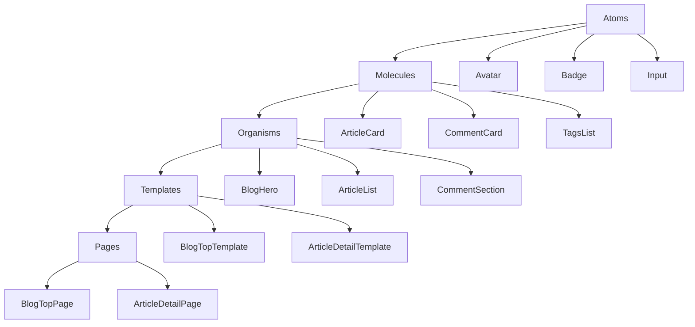

# Livedoor Blog System Development Documentation

## Table of Contents
1. [Project Overview](#project-overview)
2. [Page Specifications](#page-specifications)
3. [Data Models](#data-models)
4. [Component Architecture](#component-architecture)
5. [Technical Implementation Plan](#technical-implementation-plan)
6. [Development Workflow](#development-workflow)
7. [Project Organization](#project-organization)
8. [Testing Strategy](#testing-strategy)

## Project Overview

### Technology Stack
- **Frontend**: React 18.2.0 + TypeScript
- **Styling**: Tailwind CSS with Hiragino Sans fonts
- **Architecture**: Atomic Design Pattern
- **Mock Data**: JSON-based mock system
- **Development Ports**: 
  - Main dev server: 8070
  - Figma assets: localhost:3845

### Design System Foundation
- Primary font: Hiragino Sans (W3 for light, W6 for semibold)
- Color scheme: Zinc-based grays with blue accents
- Responsive design: Desktop-first with mobile breakpoints
- Atomic design structure: atoms → molecules → organisms → templates → pages

## Page Specifications

### 1. Individual User Blog Top Page

#### Purpose & Functionality
- Display blog overview with recent articles
- Show blog author information and profile
- Provide navigation to different content categories
- Feature latest posts with excerpts and thumbnails

#### Required Data Models
```typescript
interface Blog {
  id: string;
  title: string;
  description: string;
  author: Author;
  headerImage?: string;
  customization: BlogCustomization;
  stats: BlogStats;
}

interface Author {
  id: string;
  name: string;
  avatar: string;
  bio?: string;
  socialLinks?: SocialLink[];
}

interface BlogCustomization {
  theme: string;
  headerColor: string;
  layout: 'standard' | 'magazine' | 'minimal';
}

interface BlogStats {
  totalPosts: number;
  totalViews: number;
  followers: number;
}
```

#### UI Components Needed
**Atoms:**
- AuthorAvatar
- BlogTitle
- ViewCounter
- FollowButton

**Molecules:**
- BlogHeader
- AuthorInfo
- PostPreviewCard
- NavigationTabs

**Organisms:**
- BlogHero
- RecentPostsList
- BlogSidebar

**Templates:**
- BlogTopTemplate

#### Responsive Behavior
- **Desktop (≥1024px)**: 3-column layout (sidebar-main-sidebar)
- **Tablet (768px-1023px)**: 2-column layout (main-sidebar)
- **Mobile (≤767px)**: Single column, collapsible navigation

#### User Interactions
- Blog follow/unfollow
- Post preview hover effects
- Category/tag filtering
- Social sharing buttons
- Infinite scroll for older posts

---

### 2. Article Detail Page

#### Purpose & Functionality
- Display full article content with rich formatting
- Show article metadata (date, tags, view count)
- Enable social sharing and commenting
- Provide related articles suggestions

#### Required Data Models
```typescript
interface Article {
  id: string;
  title: string;
  content: string;
  excerpt: string;
  featuredImage?: string;
  author: Author;
  publishedAt: Date;
  updatedAt?: Date;
  tags: Tag[];
  category: Category;
  stats: ArticleStats;
  seo: SeoData;
}

interface ArticleStats {
  views: number;
  likes: number;
  shares: number;
  comments: number;
}

interface Tag {
  id: string;
  name: string;
  slug: string;
  color?: string;
}

interface Category {
  id: string;
  name: string;
  slug: string;
  description?: string;
}
```

#### UI Components Needed
**Atoms:**
- ShareButton
- LikeButton
- TagChip
- ReadingTime

**Molecules:**
- ArticleHeader
- ArticleMeta
- SocialShareBar
- TagsList

**Organisms:**
- ArticleContent
- RelatedArticles
- CommentSection
- ArticleNavigation

**Templates:**
- ArticleDetailTemplate

#### Responsive Behavior
- **Desktop**: Fixed sidebar with table of contents
- **Tablet**: Sticky header with reading progress
- **Mobile**: Collapsed metadata, floating share buttons

#### User Interactions
- Article like/unlike
- Social media sharing
- Comment submission
- Tag-based navigation
- Reading progress tracking

---

### 3. Tag-based List Page

#### Purpose & Functionality
- Display articles filtered by specific tags
- Show tag information and statistics
- Provide tag-based navigation and filtering
- Support pagination and sorting options

#### Required Data Models
```typescript
interface TagPage {
  tag: Tag;
  articles: Article[];
  pagination: PaginationData;
  relatedTags: Tag[];
  stats: TagStats;
}

interface TagStats {
  totalArticles: number;
  totalViews: number;
  popularityRank: number;
  followersCount: number;
}

interface PaginationData {
  currentPage: number;
  totalPages: number;
  totalItems: number;
  itemsPerPage: number;
  hasNext: boolean;
  hasPrevious: boolean;
}
```

#### UI Components Needed
**Atoms:**
- SortButton
- FilterToggle
- PaginationButton

**Molecules:**
- TagHeader
- SortControls
- ArticleGrid
- PaginationControls

**Organisms:**
- TaggedArticlesList
- TagNavigation
- FilterSidebar

**Templates:**
- TagListTemplate

#### Responsive Behavior
- **Desktop**: Grid layout with 2-3 articles per row
- **Tablet**: 2-column grid
- **Mobile**: Single column list view

#### User Interactions
- Sort by date, popularity, or relevance
- Filter by date range or author
- Tag following/unfollowing
- Load more articles (infinite scroll option)

---

### 4. Monthly Archive Page

#### Purpose & Functionality
- Display articles organized by month and year
- Provide calendar-based navigation
- Show posting frequency and trends
- Enable quick navigation between months

#### Required Data Models
```typescript
interface MonthlyArchive {
  year: number;
  month: number;
  articles: Article[];
  stats: MonthlyStats;
  calendar: CalendarData;
  navigation: ArchiveNavigation;
}

interface MonthlyStats {
  totalPosts: number;
  totalViews: number;
  averageViewsPerPost: number;
  mostPopularPost: Article;
}

interface CalendarData {
  days: CalendarDay[];
  firstDayOfWeek: number;
  totalDays: number;
}

interface CalendarDay {
  date: Date;
  postCount: number;
  posts: Article[];
  isCurrentMonth: boolean;
}

interface ArchiveNavigation {
  previousMonth?: MonthYearPair;
  nextMonth?: MonthYearPair;
  availableMonths: MonthYearPair[];
}
```

#### UI Components Needed
**Atoms:**
- CalendarDay
- MonthNavigator
- PostCounter

**Molecules:**
- CalendarGrid
- MonthSelector
- ArchiveStats
- DailyPostsList

**Organisms:**
- ArchiveCalendar
- MonthlyPostsList
- ArchiveNavigation

**Templates:**
- MonthlyArchiveTemplate

#### Responsive Behavior
- **Desktop**: Side-by-side calendar and post list
- **Tablet**: Stacked layout with collapsible calendar
- **Mobile**: Tabbed interface (calendar/list toggle)

#### User Interactions
- Click calendar days to filter posts
- Navigate between months/years
- Expand daily post previews
- Export monthly archives

---

### 5. Comments Page

#### Purpose & Functionality
- Display and manage article comments
- Enable comment threading and replies
- Provide moderation tools (for blog owners)
- Support real-time comment updates

#### Required Data Models
```typescript
interface Comment {
  id: string;
  content: string;
  author: CommentAuthor;
  articleId: string;
  parentId?: string;
  createdAt: Date;
  updatedAt?: Date;
  likes: number;
  replies: Comment[];
  status: CommentStatus;
  metadata: CommentMetadata;
}

interface CommentAuthor {
  id?: string;
  name: string;
  email: string;
  avatar?: string;
  website?: string;
  isRegistered: boolean;
}

interface CommentMetadata {
  ipAddress: string;
  userAgent: string;
  isSpam: boolean;
  moderationFlags: string[];
}

type CommentStatus = 'pending' | 'approved' | 'spam' | 'trash';
```

#### UI Components Needed
**Atoms:**
- CommentVoteButton
- ReplyButton
- ModerationButton
- TimestampDisplay

**Molecules:**
- CommentCard
- CommentForm
- CommentActions
- CommentThread

**Organisms:**
- CommentsList
- CommentSubmission
- CommentModeration

**Templates:**
- CommentsTemplate

#### Responsive Behavior
- **Desktop**: Nested comment threads with full width
- **Tablet**: Reduced nesting levels for better readability
- **Mobile**: Collapsed comment tree with expand/collapse

#### User Interactions
- Submit new comments
- Reply to existing comments
- Like/unlike comments
- Report inappropriate content
- Moderate comments (admin only)

## Data Models

### Core Entities

```typescript
// Base interfaces
interface BaseEntity {
  id: string;
  createdAt: Date;
  updatedAt: Date;
}

// User and Author
interface User extends BaseEntity {
  email: string;
  username: string;
  displayName: string;
  avatar?: string;
  bio?: string;
  socialLinks: SocialLink[];
  preferences: UserPreferences;
  stats: UserStats;
}

interface SocialLink {
  platform: 'twitter' | 'facebook' | 'instagram' | 'youtube' | 'website';
  url: string;
  label?: string;
}

interface UserPreferences {
  emailNotifications: boolean;
  publicProfile: boolean;
  theme: 'light' | 'dark' | 'auto';
  language: string;
}

interface UserStats {
  postsCount: number;
  followersCount: number;
  followingCount: number;
  totalViews: number;
}

// Content
interface Article extends BaseEntity {
  title: string;
  slug: string;
  content: string;
  excerpt: string;
  featuredImage?: ImageData;
  status: 'draft' | 'published' | 'archived';
  visibility: 'public' | 'private' | 'password';
  password?: string;
  author: User;
  blog: Blog;
  tags: Tag[];
  category?: Category;
  seo: SeoData;
  stats: ArticleStats;
  settings: ArticleSettings;
}

interface ImageData {
  url: string;
  alt: string;
  width?: number;
  height?: number;
  caption?: string;
}

interface SeoData {
  metaTitle?: string;
  metaDescription?: string;
  ogImage?: string;
  canonicalUrl?: string;
  noIndex: boolean;
}

interface ArticleSettings {
  allowComments: boolean;
  allowLikes: boolean;
  allowSharing: boolean;
  showAuthor: boolean;
  showDate: boolean;
}

// Blog
interface Blog extends BaseEntity {
  name: string;
  slug: string;
  description: string;
  subdomain: string;
  customDomain?: string;
  owner: User;
  collaborators: User[];
  theme: BlogTheme;
  settings: BlogSettings;
  stats: BlogStats;
}

interface BlogTheme {
  name: string;
  primaryColor: string;
  secondaryColor: string;
  fontFamily: string;
  layout: 'standard' | 'magazine' | 'minimal';
  customCss?: string;
}

interface BlogSettings {
  visibility: 'public' | 'private';
  allowComments: boolean;
  moderateComments: boolean;
  allowSubscriptions: boolean;
  showStats: boolean;
  analytics: AnalyticsSettings;
}

interface AnalyticsSettings {
  googleAnalyticsId?: string;
  trackPageViews: boolean;
  trackEvents: boolean;
}
```

### API Response Types

```typescript
interface ApiResponse<T> {
  data: T;
  meta: ResponseMeta;
  errors?: ApiError[];
}

interface ResponseMeta {
  pagination?: PaginationData;
  timestamp: Date;
  requestId: string;
}

interface ApiError {
  code: string;
  message: string;
  field?: string;
}

interface PaginatedResponse<T> extends ApiResponse<T[]> {
  meta: ResponseMeta & {
    pagination: PaginationData;
  };
}
```

## Component Architecture

### Atomic Design Structure

```
src/components/
├── atoms/
│   ├── Button/
│   ├── Text/
│   ├── Image/
│   ├── Logo/
│   ├── Input/
│   ├── TextArea/
│   ├── Checkbox/
│   ├── Badge/
│   ├── Avatar/
│   ├── Icon/
│   ├── Link/
│   ├── Divider/
│   ├── Spinner/
│   └── ProgressBar/
├── molecules/
│   ├── SearchBox/
│   ├── CommentForm/
│   ├── PostMeta/
│   ├── ShareButtons/
│   ├── TagsList/
│   ├── PaginationControls/
│   ├── SortControls/
│   ├── NavigationMenu/
│   ├── UserCard/
│   ├── ArticleCard/
│   ├── CalendarGrid/
│   └── ThemeSelector/
├── organisms/
│   ├── Header/
│   ├── Footer/
│   ├── ArticleList/
│   ├── CommentSection/
│   ├── BlogSidebar/
│   ├── NavigationBar/
│   ├── SearchResults/
│   ├── UserProfile/
│   ├── TagCloud/
│   └── ArchiveWidget/
├── templates/
│   ├── MainLayout/
│   ├── BlogLayout/
│   ├── ArticleLayout/
│   ├── ArchiveLayout/
│   └── ErrorLayout/
└── pages/
    ├── BlogTopPage/
    ├── ArticleDetailPage/
    ├── TagListPage/
    ├── MonthlyArchivePage/
    ├── CommentsPage/
    ├── NotFoundPage/
    └── MaintenancePage/
```

### New Components to Develop

#### Atoms
```typescript
// src/components/atoms/Avatar/Avatar.tsx
interface AvatarProps {
  src?: string;
  alt: string;
  size?: 'xs' | 'sm' | 'md' | 'lg' | 'xl';
  fallback?: string;
  status?: 'online' | 'offline' | 'away';
  className?: string;
}

// src/components/atoms/Badge/Badge.tsx
interface BadgeProps {
  variant?: 'default' | 'primary' | 'secondary' | 'success' | 'warning' | 'danger';
  size?: 'sm' | 'md' | 'lg';
  children: React.ReactNode;
  className?: string;
}

// src/components/atoms/Input/Input.tsx
interface InputProps {
  type?: 'text' | 'email' | 'password' | 'search' | 'url';
  placeholder?: string;
  value?: string;
  onChange?: (value: string) => void;
  disabled?: boolean;
  error?: string;
  className?: string;
}
```

#### Molecules
```typescript
// src/components/molecules/ArticleCard/ArticleCard.tsx
interface ArticleCardProps {
  article: Article;
  variant?: 'standard' | 'compact' | 'featured';
  showExcerpt?: boolean;
  showAuthor?: boolean;
  showStats?: boolean;
  className?: string;
}

// src/components/molecules/CommentCard/CommentCard.tsx
interface CommentCardProps {
  comment: Comment;
  level?: number;
  maxLevel?: number;
  onReply?: (commentId: string) => void;
  onLike?: (commentId: string) => void;
  className?: string;
}

// src/components/molecules/TagsList/TagsList.tsx
interface TagsListProps {
  tags: Tag[];
  variant?: 'default' | 'clickable' | 'removable';
  maxDisplay?: number;
  onTagClick?: (tag: Tag) => void;
  onTagRemove?: (tag: Tag) => void;
  className?: string;
}
```

## Technical Implementation Plan

### Phase 1: Foundation Setup (Week 1)

#### Data Layer
1. **Extend Type Definitions**
   ```bash
   # Add new types to src/types/index.ts
   - Blog, Article, Comment types
   - API response interfaces
   - Component prop interfaces
   ```

2. **Mock Data Enhancement**
   ```bash
   # Create new mock data files
   src/mocks/data/
   ├── blogs.ts
   ├── articles.ts
   ├── comments.ts
   ├── tags.ts
   ├── categories.ts
   └── users.ts
   ```

3. **API Handlers Setup**
   ```bash
   # Extend mock handlers
   src/mocks/handlers/
   ├── blogHandlers.ts
   ├── articleHandlers.ts
   ├── commentHandlers.ts
   ├── tagHandlers.ts
   └── userHandlers.ts
   ```

#### Component Foundation
1. **New Atoms Development**
   - Avatar, Badge, Input, TextArea
   - Icon, Spinner, ProgressBar
   - Link, Divider components

2. **Utility Hooks**
   ```typescript
   // src/hooks/
   ├── useApi.ts          // API call abstraction
   ├── usePagination.ts   // Pagination logic
   ├── useInfiniteScroll.ts // Infinite scroll
   ├── useLocalStorage.ts // Local storage management
   ├── useDebounce.ts     // Debounced values
   └── useMediaQuery.ts   // Responsive breakpoints
   ```

### Phase 2: Core Features (Weeks 2-3)

#### Blog Top Page
1. **Template and Layout**
   ```typescript
   // BlogTopTemplate with responsive grid
   // Integration with existing MainLayout
   ```

2. **Key Organisms**
   ```typescript
   // BlogHero - Hero section with blog info
   // RecentPostsList - Article previews
   // BlogSidebar - Categories, tags, archives
   ```

#### Article Detail Page
1. **Article Content Rendering**
   ```typescript
   // Rich text content display
   // Image galleries and media embeds
   // Table of contents generation
   ```

2. **Engagement Features**
   ```typescript
   // Social sharing integration
   // Reading progress indicator
   // Related articles algorithm
   ```

### Phase 3: Advanced Features (Weeks 4-5)

#### Tag and Archive Pages
1. **Filtering and Sorting**
   ```typescript
   // Multi-criteria filtering
   // Sort by date, popularity, relevance
   // Search within results
   ```

2. **Calendar Integration**
   ```typescript
   // Interactive calendar widget
   // Heat map for posting frequency
   // Quick navigation between months
   ```

#### Comments System
1. **Real-time Features**
   ```typescript
   // WebSocket connection for live updates
   // Optimistic UI updates
   // Comment threading logic
   ```

2. **Moderation Tools**
   ```typescript
   // Spam detection and filtering
   // Admin moderation interface
   // User reporting system
   ```

### API Endpoints Design

```typescript
// Blog endpoints
GET    /api/blogs/:blogId
GET    /api/blogs/:blogId/articles
POST   /api/blogs/:blogId/follow
DELETE /api/blogs/:blogId/follow

// Article endpoints
GET    /api/articles/:articleId
GET    /api/articles/:articleId/comments
POST   /api/articles/:articleId/like
DELETE /api/articles/:articleId/like

// Tag endpoints
GET    /api/tags
GET    /api/tags/:tagId/articles
POST   /api/tags/:tagId/follow

// Archive endpoints
GET    /api/blogs/:blogId/archives/:year/:month
GET    /api/blogs/:blogId/archives/calendar

// Comment endpoints
POST   /api/articles/:articleId/comments
PUT    /api/comments/:commentId
DELETE /api/comments/:commentId
POST   /api/comments/:commentId/like
```

### File Structure Expansion

```
src/
├── components/        # Existing + new components
├── hooks/            # Custom React hooks
├── mocks/            # Extended mock data
├── store/            # State management (if needed)
├── styles/           # Existing styles + new additions
├── types/            # Extended type definitions
├── utils/            # Utility functions
├── services/         # API service layer
│   ├── api.ts
│   ├── blogService.ts
│   ├── articleService.ts
│   ├── commentService.ts
│   └── tagService.ts
├── constants/        # App constants
│   ├── routes.ts
│   ├── config.ts
│   └── defaults.ts
└── lib/              # Third-party library configurations
    ├── analytics.ts
    ├── seo.ts
    └── social.ts
```

## Development Workflow

### Implementation Order

#### Week 1: Foundation
1. **Day 1-2**: Type definitions and mock data setup
2. **Day 3-4**: New atom components (Avatar, Badge, Input, etc.)
3. **Day 5-7**: Utility hooks and base service layer

#### Week 2: Blog Top Page
1. **Day 1-2**: BlogTopTemplate and layout structure
2. **Day 3-4**: BlogHero and AuthorInfo components
3. **Day 5-7**: RecentPostsList and BlogSidebar

#### Week 3: Article Detail Page
1. **Day 1-2**: ArticleDetailTemplate and content rendering
2. **Day 3-4**: ArticleMeta and SocialShareBar
3. **Day 5-7**: RelatedArticles and basic comment display

#### Week 4: Tag and Archive Pages
1. **Day 1-3**: TagListTemplate and filtering logic
2. **Day 4-7**: MonthlyArchiveTemplate and calendar widget

#### Week 5: Comments and Polish
1. **Day 1-3**: Full comment system implementation
2. **Day 4-5**: Performance optimization and testing
3. **Day 6-7**: Documentation and code review

### Component Dependencies



### Testing Strategy

#### Unit Testing
```typescript
// Component testing with React Testing Library
// Hook testing with React Hooks Testing Library
// Utility function testing with Jest

// Example test structure
describe('ArticleCard', () => {
  it('renders article title and excerpt', () => {
    // Test implementation
  });
  
  it('shows author info when enabled', () => {
    // Test implementation
  });
  
  it('handles click events correctly', () => {
    // Test implementation
  });
});
```

#### Integration Testing
```typescript
// Page-level testing with user interactions
// API integration testing with MSW
// Responsive behavior testing

// Example integration test
describe('BlogTopPage', () => {
  it('loads and displays blog data correctly', async () => {
    // Test implementation
  });
  
  it('handles article filtering and pagination', async () => {
    // Test implementation
  });
});
```

#### E2E Testing (Optional)
```typescript
// Cypress or Playwright for critical user journeys
// Cross-browser compatibility testing
// Mobile responsiveness validation
```

## Project Organization

### Coding Standards

#### TypeScript Guidelines
```typescript
// Use strict type definitions
interface Props {
  required: string;
  optional?: number;
}

// Prefer interface over type for object shapes
// Use union types for variants
type Variant = 'primary' | 'secondary' | 'outline';

// Use generics for reusable components
interface ListProps<T> {
  items: T[];
  renderItem: (item: T) => React.ReactNode;
}
```

#### Component Structure
```typescript
// Standard component template
import React from 'react';
import { ComponentProps } from '../../types';
import styles from './Component.module.css'; // If using CSS modules

export const Component: React.FC<ComponentProps> = ({
  prop1,
  prop2 = 'defaultValue',
  ...props
}) => {
  // Hooks
  // Event handlers
  // Render logic
  
  return (
    <div className="component-class" {...props}>
      {/* JSX content */}
    </div>
  );
};

export default Component;
```

#### Naming Conventions
- **Files**: PascalCase for components, camelCase for utilities
- **Props**: Descriptive names with type suffixes where appropriate
- **CSS Classes**: kebab-case or BEM methodology
- **Constants**: UPPER_SNAKE_CASE
- **Functions**: camelCase with verb prefixes (get, set, handle, etc.)

### Git Workflow

#### Branch Strategy
```bash
main                    # Production-ready code
├── develop            # Development integration
├── feature/blog-top   # Feature branches
├── feature/article-detail
├── feature/comments
└── hotfix/bug-fix     # Critical fixes
```

#### Commit Messages
```bash
feat: add BlogTopPage component with responsive layout
fix: resolve comment threading display issue
docs: update API documentation for article endpoints
style: improve mobile navigation UI consistency
refactor: extract common pagination logic to hook
test: add unit tests for ArticleCard component
```

### Performance Considerations

#### Code Splitting
```typescript
// Lazy load page components
const BlogTopPage = React.lazy(() => import('./pages/BlogTopPage'));
const ArticleDetailPage = React.lazy(() => import('./pages/ArticleDetailPage'));

// Route-based code splitting
const AppRouter = () => (
  <Suspense fallback={<LoadingSpinner />}>
    <Routes>
      <Route path="/blog/:blogId" element={<BlogTopPage />} />
      <Route path="/article/:articleId" element={<ArticleDetailPage />} />
    </Routes>
  </Suspense>
);
```

#### Optimization Strategies
- Use React.memo for expensive components
- Implement virtual scrolling for long lists
- Optimize images with lazy loading
- Cache API responses with React Query or SWR
- Minimize bundle size with tree shaking

#### Responsive Image Handling
```typescript
// Responsive image component
const ResponsiveImage: React.FC<ImageProps> = ({ src, alt, sizes }) => (
  <picture>
    <source
      media="(max-width: 768px)"
      srcSet={`${src}?w=400 1x, ${src}?w=800 2x`}
    />
    <source
      media="(max-width: 1024px)"
      srcSet={`${src}?w=600 1x, ${src}?w=1200 2x`}
    />
    
  </picture>
);
```

### Accessibility Guidelines

#### ARIA Implementation
```typescript
// Proper ARIA attributes for interactive elements
<button
  aria-label="Like this article"
  aria-pressed={isLiked}
  onClick={handleLike}
>
  <Icon name={isLiked ? 'heart-filled' : 'heart'} />
</button>

// Navigation landmarks
<nav aria-label="Blog categories">
  <ul role="list">
    {categories.map(category => (
      <li key={category.id} role="listitem">
        <Link
          to={`/category/${category.slug}`}
          aria-current={currentCategory === category.slug ? 'page' : undefined}
        >
          {category.name}
        </Link>
      </li>
    ))}
  </ul>
</nav>
```

#### Keyboard Navigation
- Tab order optimization
- Focus management for modals and dialogs
- Keyboard shortcuts for common actions
- Screen reader optimizations

### Documentation Standards

#### Component Documentation
```typescript
/**
 * ArticleCard component for displaying article previews
 * 
 * @param article - The article data to display
 * @param variant - Visual variant of the card
 * @param showExcerpt - Whether to show article excerpt
 * @param onArticleClick - Callback when article is clicked
 * 
 * @example
 * <ArticleCard
 *   article={articleData}
 *   variant="featured"
 *   showExcerpt={true}
 *   onArticleClick={handleArticleClick}
 * />
 */
export const ArticleCard: React.FC<ArticleCardProps> = ({ ... }) => {
  // Component implementation
};
```

#### API Documentation
```typescript
/**
 * Fetches articles for a specific blog
 * 
 * @param blogId - The blog identifier
 * @param options - Query options for filtering and pagination
 * @returns Promise resolving to paginated articles response
 * 
 * @throws {ApiError} When blog is not found or access is denied
 */
export const getBlogArticles = async (
  blogId: string,
  options: ArticleQueryOptions = {}
): Promise<PaginatedResponse<Article>> => {
  // Implementation
};
```

This comprehensive documentation provides a solid foundation for implementing the livedoor blog system. Each section includes practical examples, code snippets, and clear guidelines to ensure consistent development across the team.

The documentation covers all requested aspects:
- Detailed page specifications with data models and component requirements
- Technical implementation plan with phased development approach
- Development workflow with clear timelines and dependencies
- Project organization with coding standards and best practices

The modular approach using atomic design principles ensures scalability and maintainability, while the comprehensive type system provides type safety throughout the application.